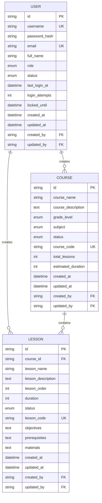

# SP1数据库实体设计文档

## 1. 文档概述

### 1.1 文档目的

本文档定义了万里书院Spring Boot后端项目SP1阶段的数据库实体设计规范，包括JPA实体类、数据库表结构、实体关系映射等。

### 1.2 适用范围

* SP1阶段数据库实体开发

* JPA实体类设计

* 数据库表结构创建

* 实体关系映射配置

### 1.3 版本信息

* 文档版本：V1.0

* 创建日期：2025-01-15

* Spring Boot版本：3.3.5

* JPA版本：3.1.x

* 数据库：PostgreSQL 15+

## 2. 实体设计原则

### 2.1 命名规范

* 实体类名：使用PascalCase，如`User`、`Course`、`Lesson`

* 属性名：使用camelCase，如`userId`、`courseName`、`createdAt`

* 表名：使用snake\_case，如`users`、`courses`、`lessons`

* 字段名：使用snake\_case，如`user_id`、`course_name`、`created_at`

### 2.2 通用字段

所有实体都应包含以下通用字段：

* `id`: 主键，使用UUID

* `createdAt`: 创建时间

* `updatedAt`: 更新时间

* `createdBy`: 创建者ID（可选）

* `updatedBy`: 更新者ID（可选）

### 2.3 数据类型规范

* 主键：UUID类型

* 时间：LocalDateTime类型

* 枚举：使用Java枚举类型

* 文本：String类型，指定长度限制

* 数值：根据业务需求选择Integer、Long、BigDecimal等

## 3. 基础实体类设计

### 3.1 BaseEntity抽象类

```java
@MappedSuperclass
@EntityListeners(AuditingEntityListener.class)
public abstract class BaseEntity {
    
    @Id
    @GeneratedValue(generator = "UUID")
    @GenericGenerator(name = "UUID", strategy = "org.hibernate.id.UUIDGenerator")
    @Column(name = "id", updatable = false, nullable = false)
    private String id;
    
    @CreatedDate
    @Column(name = "created_at", nullable = false, updatable = false)
    private LocalDateTime createdAt;
    
    @LastModifiedDate
    @Column(name = "updated_at", nullable = false)
    private LocalDateTime updatedAt;
    
    @CreatedBy
    @Column(name = "created_by", updatable = false)
    private String createdBy;
    
    @LastModifiedBy
    @Column(name = "updated_by")
    private String updatedBy;
    
    // Getters and Setters
    // ...
}
```

## 4. 用户实体设计

### 4.1 User实体类

```java
@Entity
@Table(name = "users")
@Data
@NoArgsConstructor
@AllArgsConstructor
@Builder
public class User extends BaseEntity {
    
    @Column(name = "username", nullable = false, unique = true, length = 50)
    private String username;
    
    @Column(name = "password_hash", nullable = false, length = 255)
    private String passwordHash;
    
    @Column(name = "email", nullable = false, unique = true, length = 100)
    private String email;
    
    @Column(name = "full_name", nullable = false, length = 100)
    private String fullName;
    
    @Enumerated(EnumType.STRING)
    @Column(name = "role", nullable = false, length = 20)
    private UserRole role;
    
    @Enumerated(EnumType.STRING)
    @Column(name = "status", nullable = false, length = 20)
    @Builder.Default
    private UserStatus status = UserStatus.ACTIVE;
    
    @Column(name = "last_login_at")
    private LocalDateTime lastLoginAt;
    
    @Column(name = "login_attempts", nullable = false)
    @Builder.Default
    private Integer loginAttempts = 0;
    
    @Column(name = "locked_until")
    private LocalDateTime lockedUntil;
    
    // 一对多关系：用户创建的课程
    @OneToMany(mappedBy = "createdByUser", cascade = CascadeType.ALL, fetch = FetchType.LAZY)
    @JsonIgnore
    private List<Course> createdCourses = new ArrayList<>();
    
    // 一对多关系：用户创建的课时
    @OneToMany(mappedBy = "createdByUser", cascade = CascadeType.ALL, fetch = FetchType.LAZY)
    @JsonIgnore
    private List<Lesson> createdLessons = new ArrayList<>();
}
```

### 4.2 UserRole枚举

```java
public enum UserRole {
    HQ_TEACHER("总部教师", "ROLE_HQ_TEACHER"),
    BRANCH_TEACHER("分校教师", "ROLE_BRANCH_TEACHER"),
    STUDENT("学生", "ROLE_STUDENT"),
    ADMIN("管理员", "ROLE_ADMIN");
    
    private final String displayName;
    private final String authority;
    
    UserRole(String displayName, String authority) {
        this.displayName = displayName;
        this.authority = authority;
    }
    
    // Getters
    public String getDisplayName() { return displayName; }
    public String getAuthority() { return authority; }
}
```

### 4.3 UserStatus枚举

```java
public enum UserStatus {
    ACTIVE("激活"),
    INACTIVE("未激活"),
    LOCKED("锁定"),
    DELETED("已删除");
    
    private final String displayName;
    
    UserStatus(String displayName) {
        this.displayName = displayName;
    }
    
    public String getDisplayName() { return displayName; }
}
```

## 5. 课程实体设计

### 5.1 Course实体类

```java
@Entity
@Table(name = "courses")
@Data
@NoArgsConstructor
@AllArgsConstructor
@Builder
public class Course extends BaseEntity {
    
    @Column(name = "course_name", nullable = false, length = 200)
    private String courseName;
    
    @Column(name = "course_description", columnDefinition = "TEXT")
    private String courseDescription;
    
    @Enumerated(EnumType.STRING)
    @Column(name = "grade_level", nullable = false, length = 20)
    private GradeLevel gradeLevel;
    
    @Enumerated(EnumType.STRING)
    @Column(name = "subject", nullable = false, length = 20)
    private Subject subject;
    
    @Enumerated(EnumType.STRING)
    @Column(name = "status", nullable = false, length = 20)
    @Builder.Default
    private CourseStatus status = CourseStatus.ACTIVE;
    
    @Column(name = "course_code", unique = true, length = 50)
    private String courseCode;
    
    @Column(name = "total_lessons")
    @Builder.Default
    private Integer totalLessons = 0;
    
    @Column(name = "estimated_duration")
    private Integer estimatedDuration; // 预计总时长（分钟）
    
    // 多对一关系：课程创建者
    @ManyToOne(fetch = FetchType.LAZY)
    @JoinColumn(name = "created_by", referencedColumnName = "id", insertable = false, updatable = false)
    @JsonIgnore
    private User createdByUser;
    
    // 一对多关系：课程包含的课时
    @OneToMany(mappedBy = "course", cascade = CascadeType.ALL, fetch = FetchType.LAZY)
    @OrderBy("lessonOrder ASC")
    @JsonIgnore
    private List<Lesson> lessons = new ArrayList<>();
    
    // 业务方法
    public void addLesson(Lesson lesson) {
        lessons.add(lesson);
        lesson.setCourse(this);
        this.totalLessons = lessons.size();
    }
    
    public void removeLesson(Lesson lesson) {
        lessons.remove(lesson);
        lesson.setCourse(null);
        this.totalLessons = lessons.size();
    }
}
```

### 5.2 GradeLevel枚举

```java
public enum GradeLevel {
    GRADE_1("一年级", 1),
    GRADE_2("二年级", 2),
    GRADE_3("三年级", 3),
    GRADE_4("四年级", 4),
    GRADE_5("五年级", 5),
    GRADE_6("六年级", 6),
    GRADE_7("七年级", 7),
    GRADE_8("八年级", 8),
    GRADE_9("九年级", 9),
    GRADE_10("十年级", 10),
    GRADE_11("十一年级", 11),
    GRADE_12("十二年级", 12);
    
    private final String displayName;
    private final Integer level;
    
    GradeLevel(String displayName, Integer level) {
        this.displayName = displayName;
        this.level = level;
    }
    
    // Getters
    public String getDisplayName() { return displayName; }
    public Integer getLevel() { return level; }
}
```

### 5.3 Subject枚举

```java
public enum Subject {
    MATH("数学"),
    CHINESE("语文"),
    ENGLISH("英语"),
    PHYSICS("物理"),
    CHEMISTRY("化学"),
    BIOLOGY("生物"),
    HISTORY("历史"),
    GEOGRAPHY("地理"),
    POLITICS("政治"),
    COMPUTER("计算机");
    
    private final String displayName;
    
    Subject(String displayName) {
        this.displayName = displayName;
    }
    
    public String getDisplayName() { return displayName; }
}
```

### 5.4 CourseStatus枚举

```java
public enum CourseStatus {
    DRAFT("草稿"),
    ACTIVE("激活"),
    INACTIVE("未激活"),
    ARCHIVED("已归档"),
    DELETED("已删除");
    
    private final String displayName;
    
    CourseStatus(String displayName) {
        this.displayName = displayName;
    }
    
    public String getDisplayName() { return displayName; }
}
```

## 6. 课时实体设计

### 6.1 Lesson实体类

```java
@Entity
@Table(name = "lessons")
@Data
@NoArgsConstructor
@AllArgsConstructor
@Builder
public class Lesson extends BaseEntity {
    
    @Column(name = "lesson_name", nullable = false, length = 200)
    private String lessonName;
    
    @Column(name = "lesson_description", columnDefinition = "TEXT")
    private String lessonDescription;
    
    @Column(name = "lesson_order", nullable = false)
    private Integer lessonOrder;
    
    @Column(name = "duration")
    private Integer duration; // 课时时长（分钟）
    
    @Enumerated(EnumType.STRING)
    @Column(name = "status", nullable = false, length = 20)
    @Builder.Default
    private LessonStatus status = LessonStatus.ACTIVE;
    
    @Column(name = "lesson_code", unique = true, length = 50)
    private String lessonCode;
    
    @Column(name = "objectives", columnDefinition = "TEXT")
    private String objectives; // 学习目标
    
    @Column(name = "prerequisites", columnDefinition = "TEXT")
    private String prerequisites; // 前置要求
    
    @Column(name = "materials", columnDefinition = "TEXT")
    private String materials; // 教学材料
    
    // 多对一关系：所属课程
    @ManyToOne(fetch = FetchType.LAZY)
    @JoinColumn(name = "course_id", nullable = false)
    @JsonIgnore
    private Course course;
    
    // 多对一关系：课时创建者
    @ManyToOne(fetch = FetchType.LAZY)
    @JoinColumn(name = "created_by", referencedColumnName = "id", insertable = false, updatable = false)
    @JsonIgnore
    private User createdByUser;
    
    // 业务方法
    @PrePersist
    @PreUpdate
    private void generateLessonCode() {
        if (lessonCode == null && course != null) {
            lessonCode = course.getCourseCode() + "-L" + String.format("%03d", lessonOrder);
        }
    }
}
```

### 6.2 LessonStatus枚举

```java
public enum LessonStatus {
    DRAFT("草稿"),
    PUBLISHED("已发布"),
    ARCHIVED("已归档");
    
    private final String displayName;
    
    LessonStatus(String displayName) {
        this.displayName = displayName;
    }
    
    public String getDisplayName() { return displayName; }
}
```

## 7. 数据库表结构

### 7.1 用户表（users）

```sql
CREATE TABLE users (
    id VARCHAR(36) PRIMARY KEY,
    username VARCHAR(50) NOT NULL UNIQUE,
    password_hash VARCHAR(255) NOT NULL,
    email VARCHAR(100) NOT NULL UNIQUE,
    full_name VARCHAR(100) NOT NULL,
    role VARCHAR(20) NOT NULL CHECK (role IN ('HQ_TEACHER', 'BRANCH_TEACHER', 'STUDENT', 'ADMIN')),
    status VARCHAR(20) NOT NULL DEFAULT 'ACTIVE' CHECK (status IN ('ACTIVE', 'INACTIVE', 'LOCKED', 'DELETED')),
    last_login_at TIMESTAMP,
    login_attempts INTEGER NOT NULL DEFAULT 0,
    locked_until TIMESTAMP,
    created_at TIMESTAMP NOT NULL DEFAULT CURRENT_TIMESTAMP,
    updated_at TIMESTAMP NOT NULL DEFAULT CURRENT_TIMESTAMP,
    created_by VARCHAR(36),
    updated_by VARCHAR(36)
);

-- 索引
CREATE INDEX idx_users_username ON users(username);
CREATE INDEX idx_users_email ON users(email);
CREATE INDEX idx_users_role ON users(role);
CREATE INDEX idx_users_status ON users(status);
CREATE INDEX idx_users_created_at ON users(created_at);
```

### 7.2 课程表（courses）

```sql
CREATE TABLE courses (
    id VARCHAR(36) PRIMARY KEY,
    course_name VARCHAR(200) NOT NULL,
    course_description TEXT,
    grade_level VARCHAR(20) NOT NULL CHECK (grade_level IN ('GRADE_1', 'GRADE_2', 'GRADE_3', 'GRADE_4', 'GRADE_5', 'GRADE_6', 'GRADE_7', 'GRADE_8', 'GRADE_9', 'GRADE_10', 'GRADE_11', 'GRADE_12')),
    subject VARCHAR(20) NOT NULL CHECK (subject IN ('MATH', 'CHINESE', 'ENGLISH', 'PHYSICS', 'CHEMISTRY', 'BIOLOGY', 'HISTORY', 'GEOGRAPHY', 'POLITICS', 'COMPUTER')),
    status VARCHAR(20) NOT NULL DEFAULT 'ACTIVE' CHECK (status IN ('DRAFT', 'ACTIVE', 'INACTIVE', 'ARCHIVED', 'DELETED')),
    course_code VARCHAR(50) UNIQUE,
    total_lessons INTEGER DEFAULT 0,
    estimated_duration INTEGER,
    created_at TIMESTAMP NOT NULL DEFAULT CURRENT_TIMESTAMP,
    updated_at TIMESTAMP NOT NULL DEFAULT CURRENT_TIMESTAMP,
    created_by VARCHAR(36),
    updated_by VARCHAR(36),
    FOREIGN KEY (created_by) REFERENCES users(id)
);

-- 索引
CREATE INDEX idx_courses_course_name ON courses(course_name);
CREATE INDEX idx_courses_grade_level ON courses(grade_level);
CREATE INDEX idx_courses_subject ON courses(subject);
CREATE INDEX idx_courses_status ON courses(status);
CREATE INDEX idx_courses_course_code ON courses(course_code);
CREATE INDEX idx_courses_created_by ON courses(created_by);
CREATE INDEX idx_courses_created_at ON courses(created_at);
```

### 7.3 课时表（lessons）

```sql
CREATE TABLE lessons (
    id VARCHAR(36) PRIMARY KEY,
    course_id VARCHAR(36) NOT NULL,
    lesson_name VARCHAR(200) NOT NULL,
    lesson_description TEXT,
    lesson_order INTEGER NOT NULL,
    duration INTEGER,
    status VARCHAR(20) NOT NULL DEFAULT 'ACTIVE' CHECK (status IN ('DRAFT', 'ACTIVE', 'INACTIVE', 'ARCHIVED', 'DELETED')),
    lesson_code VARCHAR(50) UNIQUE,
    objectives TEXT,
    prerequisites TEXT,
    materials TEXT,
    created_at TIMESTAMP NOT NULL DEFAULT CURRENT_TIMESTAMP,
    updated_at TIMESTAMP NOT NULL DEFAULT CURRENT_TIMESTAMP,
    created_by VARCHAR(36),
    updated_by VARCHAR(36),
    FOREIGN KEY (course_id) REFERENCES courses(id) ON DELETE CASCADE,
    FOREIGN KEY (created_by) REFERENCES users(id),
    UNIQUE(course_id, lesson_order)
);

-- 索引
CREATE INDEX idx_lessons_course_id ON lessons(course_id);
CREATE INDEX idx_lessons_lesson_name ON lessons(lesson_name);
CREATE INDEX idx_lessons_lesson_order ON lessons(lesson_order);
CREATE INDEX idx_lessons_status ON lessons(status);
CREATE INDEX idx_lessons_lesson_code ON lessons(lesson_code);
CREATE INDEX idx_lessons_created_by ON lessons(created_by);
CREATE INDEX idx_lessons_created_at ON lessons(created_at);
```

## 8. Repository接口设计

### 8.1 UserRepository

```java
@Repository
public interface UserRepository extends JpaRepository<User, String>, JpaSpecificationExecutor<User> {
    
    Optional<User> findByUsername(String username);
    
    Optional<User> findByEmail(String email);
    
    boolean existsByUsername(String username);
    
    boolean existsByEmail(String email);
    
    List<User> findByRole(UserRole role);
    
    List<User> findByStatus(UserStatus status);
    
    @Query("SELECT u FROM User u WHERE u.status = :status AND u.role = :role")
    Page<User> findByStatusAndRole(@Param("status") UserStatus status, 
                                   @Param("role") UserRole role, 
                                   Pageable pageable);
    
    @Modifying
    @Query("UPDATE User u SET u.lastLoginAt = :loginTime WHERE u.id = :userId")
    void updateLastLoginTime(@Param("userId") String userId, 
                            @Param("loginTime") LocalDateTime loginTime);
    
    @Modifying
    @Query("UPDATE User u SET u.loginAttempts = :attempts WHERE u.id = :userId")
    void updateLoginAttempts(@Param("userId") String userId, 
                            @Param("attempts") Integer attempts);
}
```

### 8.2 CourseRepository

```java
@Repository
public interface CourseRepository extends JpaRepository<Course, String>, JpaSpecificationExecutor<Course> {
    
    List<Course> findByGradeLevel(GradeLevel gradeLevel);
    
    List<Course> findBySubject(Subject subject);
    
    List<Course> findByStatus(CourseStatus status);
    
    Page<Course> findByGradeLevelAndSubject(GradeLevel gradeLevel, 
                                           Subject subject, 
                                           Pageable pageable);
    
    @Query("SELECT c FROM Course c WHERE c.courseName LIKE %:keyword% OR c.courseDescription LIKE %:keyword%")
    Page<Course> findByKeyword(@Param("keyword") String keyword, Pageable pageable);
    
    @Query("SELECT c FROM Course c WHERE c.createdBy = :createdBy")
    List<Course> findByCreatedBy(@Param("createdBy") String createdBy);
    
    boolean existsByCourseCode(String courseCode);
    
    Optional<Course> findByCourseCode(String courseCode);
    
    @Query("SELECT COUNT(c) FROM Course c WHERE c.status = :status")
    Long countByStatus(@Param("status") CourseStatus status);
}
```

### 8.3 LessonRepository

```java
@Repository
public interface LessonRepository extends JpaRepository<Lesson, String>, JpaSpecificationExecutor<Lesson> {
    
    List<Lesson> findByCourseId(String courseId);
    
    Page<Lesson> findByCourseId(String courseId, Pageable pageable);
    
    List<Lesson> findByCourseIdAndStatus(String courseId, LessonStatus status);
    
    @Query("SELECT l FROM Lesson l WHERE l.course.id = :courseId ORDER BY l.lessonOrder ASC")
    List<Lesson> findByCourseIdOrderByLessonOrder(@Param("courseId") String courseId);
    
    Optional<Lesson> findByCourseIdAndLessonOrder(String courseId, Integer lessonOrder);
    
    boolean existsByLessonCode(String lessonCode);
    
    Optional<Lesson> findByLessonCode(String lessonCode);
    
    @Query("SELECT MAX(l.lessonOrder) FROM Lesson l WHERE l.course.id = :courseId")
    Optional<Integer> findMaxLessonOrderByCourseId(@Param("courseId") String courseId);
    
    @Query("SELECT COUNT(l) FROM Lesson l WHERE l.course.id = :courseId AND l.status = :status")
    Long countByCourseIdAndStatus(@Param("courseId") String courseId, 
                                 @Param("status") LessonStatus status);
}
```

## 9. 数据验证规范

### 9.1 Bean Validation注解

```java
// 用户实体验证示例
@Entity
public class User extends BaseEntity {
    
    @NotBlank(message = "用户名不能为空")
    @Size(min = 3, max = 50, message = "用户名长度必须在3-50个字符之间")
    @Pattern(regexp = "^[a-zA-Z0-9_]+$", message = "用户名只能包含字母、数字和下划线")
    private String username;
    
    @NotBlank(message = "邮箱不能为空")
    @Email(message = "邮箱格式不正确")
    @Size(max = 100, message = "邮箱长度不能超过100个字符")
    private String email;
    
    @NotBlank(message = "姓名不能为空")
    @Size(min = 2, max = 100, message = "姓名长度必须在2-100个字符之间")
    private String fullName;
    
    @NotNull(message = "用户角色不能为空")
    private UserRole role;
    
    // ...
}
```

### 9.2 自定义验证器

```java
@Target({ElementType.FIELD})
@Retention(RetentionPolicy.RUNTIME)
@Constraint(validatedBy = CourseCodeValidator.class)
public @interface ValidCourseCode {
    String message() default "课程代码格式不正确";
    Class<?>[] groups() default {};
    Class<? extends Payload>[] payload() default {};
}

@Component
public class CourseCodeValidator implements ConstraintValidator<ValidCourseCode, String> {
    
    @Override
    public boolean isValid(String courseCode, ConstraintValidatorContext context) {
        if (courseCode == null || courseCode.trim().isEmpty()) {
            return true; // 让@NotBlank处理空值验证
        }
        // 课程代码格式：GRADE_SUBJECT_YYYYMM，如：G1_MATH_202501
        return courseCode.matches("^G[1-9]|1[0-2]_[A-Z]+_\\d{6}$");
    }
}
```

## 10. JPA配置

### 10.1 审计配置

```java
@Configuration
@EnableJpaAuditing
public class JpaAuditingConfig {
    
    @Bean
    public AuditorAware<String> auditorProvider() {
        return new SpringSecurityAuditorAware();
    }
}

@Component
public class SpringSecurityAuditorAware implements AuditorAware<String> {
    
    @Override
    public Optional<String> getCurrentAuditor() {
        Authentication authentication = SecurityContextHolder.getContext().getAuthentication();
        
        if (authentication == null || !authentication.isAuthenticated() 
            || authentication instanceof AnonymousAuthenticationToken) {
            return Optional.empty();
        }
        
        UserPrincipal userPrincipal = (UserPrincipal) authentication.getPrincipal();
        return Optional.ofNullable(userPrincipal.getId());
    }
}
```

### 10.2 数据库配置

```yaml
spring:
  jpa:
    hibernate:
      ddl-auto: validate
      naming:
        physical-strategy: org.hibernate.boot.model.naming.SnakeCasePhysicalNamingStrategy
        implicit-strategy: org.springframework.boot.orm.jpa.hibernate.SpringImplicitNamingStrategy
    properties:
      hibernate:
        dialect: org.hibernate.dialect.PostgreSQLDialect
        format_sql: true
        show_sql: false
        jdbc:
          time_zone: UTC
    show-sql: false
  datasource:
    hikari:
      maximum-pool-size: 20
      minimum-idle: 5
      idle-timeout: 300000
      connection-timeout: 20000
      max-lifetime: 1200000
```

## 11. 实体关系图



## 12. 数据初始化

### 12.1 初始化脚本

```sql
-- 插入默认管理员用户
INSERT INTO users (id, username, password_hash, email, full_name, role, status, created_at, updated_at)
VALUES (
    'admin-uuid-string',
    'admin',
    '$2a$10$encrypted_password_hash',
    'admin@wanli.edu',
    '系统管理员',
    'ADMIN',
    'ACTIVE',
    CURRENT_TIMESTAMP,
    CURRENT_TIMESTAMP
);

-- 插入测试教师用户
INSERT INTO users (id, username, password_hash, email, full_name, role, status, created_at, updated_at)
VALUES (
    'teacher-uuid-string',
    'teacher001',
    '$2a$10$encrypted_password_hash',
    'teacher001@wanli.edu',
    '张老师',
    'HQ_TEACHER',
    'ACTIVE',
    CURRENT_TIMESTAMP,
    CURRENT_TIMESTAMP
);
```

## 13. 性能优化建议

### 13.1 索引策略

* 为经常查询的字段创建索引
* 为外键字段创建索引
* 为复合查询创建复合索引
* 定期分析索引使用情况

### 13.2 查询优化

* 使用@Query注解优化复杂查询
* 合理使用FetchType.LAZY避免N+1问题
* 使用@EntityGraph优化关联查询
* 使用分页查询避免大量数据加载

### 13.3 缓存策略

* 对不经常变化的数据使用二级缓存
* 使用Redis缓存热点数据
* 合理设置缓存过期时间

## 14. 验收标准

### 14.1 实体设计验收

* 所有实体类符合命名规范
* 实体关系映射正确
* 数据验证注解完整
* 审计字段配置正确

### 14.2 数据库验收

* 表结构创建成功
* 索引创建完整
* 外键约束正确
* 初始数据插入成功

### 14.3 Repository验收

* 基础CRUD操作正常
* 自定义查询方法正确
* 分页查询功能正常
* 事务处理正确

## 15. 附录

### 15.1 相关文档

* 《万里书院 - 数据库设计文档 (V0.2).md》
* 《SP1后端API接口设计文档.md》
* 《万里书院 - Sprint 1 任务说明书.md》

### 15.2 开发工具

* IDE: IntelliJ IDEA
* 数据库工具: DBeaver
* API测试: Postman
* 版本控制: Git

