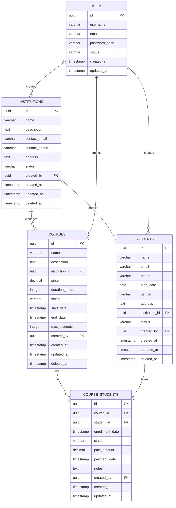

# 已合并到数据库设计文档 - 完整版

本文档内容已合并到 `database_design.md` 文档中，请查看完整版数据库设计文档。

合并内容包括：
- 教育机构实体设计
- 学员实体设计
- 课程学员关联实体设计
- 相关数据库表结构
- Repository接口设计

请使用 `database_design.md` 作为统一的数据库设计参考文档。

## 2. 实体关系图(ERD)



## 3. 详细表结构设计

### 3.1 教育机构表 (institutions)

```sql
CREATE TABLE institutions (
    id UUID PRIMARY KEY DEFAULT gen_random_uuid(),
    name VARCHAR(100) NOT NULL,
    description TEXT,
    contact_email VARCHAR(100),
    contact_phone VARCHAR(20),
    address TEXT,
    status VARCHAR(20) DEFAULT 'ACTIVE' CHECK (status IN ('ACTIVE', 'INACTIVE', 'SUSPENDED')),
    created_by UUID NOT NULL,
    created_at TIMESTAMP WITH TIME ZONE DEFAULT NOW(),
    updated_at TIMESTAMP WITH TIME ZONE DEFAULT NOW(),
    deleted_at TIMESTAMP WITH TIME ZONE,
    
    CONSTRAINT fk_institutions_created_by FOREIGN KEY (created_by) REFERENCES users(id)
);

-- 索引
CREATE INDEX idx_institutions_name ON institutions(name);
CREATE INDEX idx_institutions_status ON institutions(status);
CREATE INDEX idx_institutions_created_by ON institutions(created_by);
CREATE INDEX idx_institutions_created_at ON institutions(created_at DESC);
CREATE INDEX idx_institutions_deleted_at ON institutions(deleted_at);
```

**字段说明：**

* `id`: 主键，UUID类型

* `name`: 机构名称，必填，最大100字符

* `description`: 机构描述，可选

* `contact_email`: 联系邮箱，可选

* `contact_phone`: 联系电话，可选

* `address`: 机构地址，可选

* `status`: 机构状态，枚举值：ACTIVE(活跃)、INACTIVE(非活跃)、SUSPENDED(暂停)

* `created_by`: 创建者ID，外键关联users表

* `created_at`: 创建时间

* `updated_at`: 更新时间

* `deleted_at`: 软删除时间

### 3.2 课程表 (courses)

```sql
CREATE TABLE courses (
    id UUID PRIMARY KEY DEFAULT gen_random_uuid(),
    name VARCHAR(100) NOT NULL,
    description TEXT,
    institution_id UUID NOT NULL,
    price DECIMAL(10,2) DEFAULT 0.00,
    duration_hours INTEGER DEFAULT 0,
    status VARCHAR(20) DEFAULT 'DRAFT' CHECK (status IN ('DRAFT', 'PUBLISHED', 'ONGOING', 'COMPLETED', 'CANCELLED')),
    start_date TIMESTAMP WITH TIME ZONE,
    end_date TIMESTAMP WITH TIME ZONE,
    max_students INTEGER DEFAULT 50,
    created_by UUID NOT NULL,
    created_at TIMESTAMP WITH TIME ZONE DEFAULT NOW(),
    updated_at TIMESTAMP WITH TIME ZONE DEFAULT NOW(),
    deleted_at TIMESTAMP WITH TIME ZONE,
    
    CONSTRAINT fk_courses_institution_id FOREIGN KEY (institution_id) REFERENCES institutions(id),
    CONSTRAINT fk_courses_created_by FOREIGN KEY (created_by) REFERENCES users(id),
    CONSTRAINT chk_courses_dates CHECK (end_date IS NULL OR start_date IS NULL OR end_date >= start_date),
    CONSTRAINT chk_courses_price CHECK (price >= 0),
    CONSTRAINT chk_courses_duration CHECK (duration_hours >= 0),
    CONSTRAINT chk_courses_max_students CHECK (max_students > 0)
);

-- 索引
CREATE INDEX idx_courses_name ON courses(name);
CREATE INDEX idx_courses_institution_id ON courses(institution_id);
CREATE INDEX idx_courses_status ON courses(status);
CREATE INDEX idx_courses_start_date ON courses(start_date);
CREATE INDEX idx_courses_created_by ON courses(created_by);
CREATE INDEX idx_courses_created_at ON courses(created_at DESC);
CREATE INDEX idx_courses_deleted_at ON courses(deleted_at);
```

**字段说明：**

* `id`: 主键，UUID类型

* `name`: 课程名称，必填，最大100字符

* `description`: 课程描述，可选

* `institution_id`: 所属机构ID，外键关联institutions表

* `price`: 课程价格，默认0.00，非负数

* `duration_hours`: 课程时长(小时)，默认0，非负数

* `status`: 课程状态，枚举值：DRAFT(草稿)、PUBLISHED(已发布)、ONGOING(进行中)、COMPLETED(已完成)、CANCELLED(已取消)

* `start_date`: 开始时间，可选

* `end_date`: 结束时间，可选，必须大于等于开始时间

* `max_students`: 最大学员数，默认50，必须大于0

* `created_by`: 创建者ID，外键关联users表

* `created_at`: 创建时间

* `updated_at`: 更新时间

* `deleted_at`: 软删除时间

### 3.3 学员表 (students)

```sql
CREATE TABLE students (
    id UUID PRIMARY KEY DEFAULT gen_random_uuid(),
    name VARCHAR(50) NOT NULL,
    email VARCHAR(100),
    phone VARCHAR(20),
    birth_date DATE,
    gender VARCHAR(10) CHECK (gender IN ('MALE', 'FEMALE', 'OTHER')),
    address TEXT,
    institution_id UUID NOT NULL,
    status VARCHAR(20) DEFAULT 'ACTIVE' CHECK (status IN ('ACTIVE', 'INACTIVE', 'GRADUATED', 'DROPPED')),
    created_by UUID NOT NULL,
    created_at TIMESTAMP WITH TIME ZONE DEFAULT NOW(),
    updated_at TIMESTAMP WITH TIME ZONE DEFAULT NOW(),
    deleted_at TIMESTAMP WITH TIME ZONE,
    
    CONSTRAINT fk_students_institution_id FOREIGN KEY (institution_id) REFERENCES institutions(id),
    CONSTRAINT fk_students_create
```

