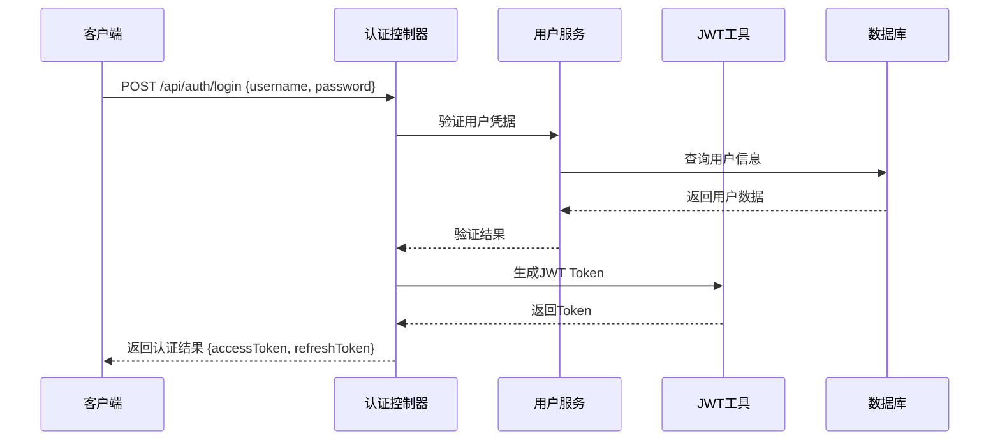
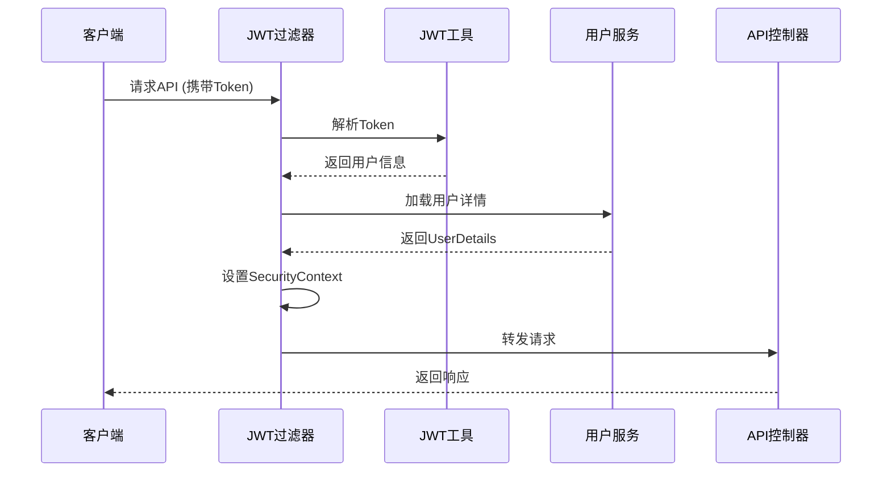

# JWT认证机制设计文档

## 1. 文档概述

### 1.1 文档目的

本文档详细描述了Wanli Academy项目中JWT（JSON Web Token）认证机制的设计与实现方案，基于Spring Security 6.x框架。

### 1.2 适用范围

* 后端API认证授权

* 用户登录状态管理

* 角色权限控制

* Token生命周期管理

### 1.3 版本信息

* 文档版本：v1.0.0

* Spring Boot版本：3.5.x

* Spring Security版本：6.x

* 创建日期：2025-01-16

## 2. JWT认证架构设计

### 2.1 整体架构

```
┌─────────────┐    ┌──────────────┐    ┌─────────────┐
│   前端应用   │───▶│  认证过滤器   │───▶│  业务控制器  │
└─────────────┘    └──────────────┘    └─────────────┘
                           │
                           ▼
                   ┌──────────────┐
                   │  JWT工具类   │
                   └──────────────┘
                           │
                           ▼
                   ┌──────────────┐
                   │  用户服务层   │
                   └──────────────┘
```

### 2.2 核心组件

* **JwtAuthenticationFilter**: JWT认证过滤器

* **JwtUtil**: JWT工具类（生成、解析、验证）

* **UserDetailsService**: 用户详情服务

* **SecurityConfig**: 安全配置类

* **AuthController**: 认证控制器

## 3. Token生成和验证机制

### 3.1 JWT结构设计

```json
{
  "header": {
    "alg": "HS256",
    "typ": "JWT"
  },
  "payload": {
    "sub": "用户ID",
    "username": "用户名",
    "roles": ["ROLE_USER", "ROLE_ADMIN"],
    "iat": 1642694400,
    "exp": 1642780800
  },
  "signature": "签名信息"
}
```

### 3.2 JwtUtil工具类设计

```java
@Component
public class JwtUtil {
    
    private static final String SECRET_KEY = "${jwt.secret}";
    private static final long ACCESS_TOKEN_EXPIRATION = 24 * 60 * 60 * 1000L; // 24小时
    private static final long REFRESH_TOKEN_EXPIRATION = 7 * 24 * 60 * 60 * 1000L; // 7天
    
    /**
     * 生成访问Token
     */
    public String generateAccessToken(UserDetails userDetails) {
        Map<String, Object> claims = new HashMap<>();
        claims.put("username", userDetails.getUsername());
        claims.put("roles", userDetails.getAuthorities());
        return createToken(claims, userDetails.getUsername(), ACCESS_TOKEN_EXPIRATION);
    }
    
    /**
     * 生成刷新Token
     */
    public String generateRefreshToken(String username) {
        return createToken(new HashMap<>(), username, REFRESH_TOKEN_EXPIRATION);
    }
    
    /**
     * 验证Token有效性
     */
    public Boolean validateToken(String token, UserDetails userDetails) {
        final String username = extractUsername(token);
        return (username.equals(userDetails.getUsername()) && !isTokenExpired(token));
    }
    
    // 其他工具方法...
}
```

### 3.3 认证过滤器设计

```java
@Component
public class JwtAuthenticationFilter extends OncePerRequestFilter {
    
    @Autowired
    private JwtUtil jwtUtil;
    
    @Autowired
    private UserDetailsService userDetailsService;
    
    @Override
    protected void doFilterInternal(HttpServletRequest request, 
                                  HttpServletResponse response, 
                                  FilterChain filterChain) throws ServletException, IOException {
        
        final String authorizationHeader = request.getHeader("Authorization");
        
        String username = null;
        String jwt = null;
        
        if (authorizationHeader != null && authorizationHeader.startsWith("Bearer ")) {
            jwt = authorizationHeader.substring(7);
            username = jwtUtil.extractUsername(jwt);
        }
        
        if (username != null && SecurityContextHolder.getContext().getAuthentication() == null) {
            UserDetails userDetails = userDetailsService.loadUserByUsername(username);
            
            if (jwtUtil.validateToken(jwt, userDetails)) {
                UsernamePasswordAuthenticationToken authToken = 
                    new UsernamePasswordAuthenticationToken(userDetails, null, userDetails.getAuthorities());
                authToken.setDetails(new WebAuthenticationDetailsSource().buildDetails(request));
                SecurityContextHolder.getContext().setAuthentication(authToken);
            }
        }
        
        filterChain.doFilter(request, response);
    }
}
```

## 4. 用户角色权限控制

### 4.1 角色定义

```java
public enum UserRole {
    ADMIN("管理员", "ROLE_ADMIN"),
    TEACHER("教师", "ROLE_TEACHER"),
    STUDENT("学生", "ROLE_STUDENT");
    
    private final String description;
    private final String authority;
    
    // 构造函数和getter方法...
}
```

### 4.2 权限控制注解

```java
// 方法级权限控制
@PreAuthorize("hasRole('ADMIN')")
public ResponseEntity<?> adminOnlyMethod() {
    // 仅管理员可访问
}

@PreAuthorize("hasAnyRole('ADMIN', 'TEACHER')")
public ResponseEntity<?> teacherMethod() {
    // 管理员和教师可访问
}

@PreAuthorize("hasRole('STUDENT') or hasRole('TEACHER')")
public ResponseEntity<?> userMethod() {
    // 学生和教师可访问
}
```

### 4.3 URL级权限配置

```java
@Configuration
@EnableWebSecurity
@EnableMethodSecurity(prePostEnabled = true)
public class SecurityConfig {
    
    @Bean
    public SecurityFilterChain filterChain(HttpSecurity http) throws Exception {
        http.csrf(csrf -> csrf.disable())
            .sessionManagement(session -> session.sessionCreationPolicy(SessionCreationPolicy.STATELESS))
            .authorizeHttpRequests(auth -> auth
                .requestMatchers("/api/auth/**").permitAll()
                .requestMatchers("/api/public/**").permitAll()
                .requestMatchers(HttpMethod.GET, "/api/courses/**").hasAnyRole("STUDENT", "TEACHER", "ADMIN")
                .requestMatchers(HttpMethod.POST, "/api/courses/**").hasAnyRole("TEACHER", "ADMIN")
                .requestMatchers("/api/admin/**").hasRole("ADMIN")
                .anyRequest().authenticated()
            )
            .addFilterBefore(jwtAuthenticationFilter, UsernamePasswordAuthenticationFilter.class);
        
        return http.build();
    }
}
```

## 5. 认证流程设计

### 5.1 登录认证流程



### 5.2 API访问流程



### 5.3 认证控制器实现

```java
@RestController
@RequestMapping("/api/auth")
public class AuthController {
    
    @Autowired
    private AuthenticationManager authenticationManager;
    
    @Autowired
    private JwtUtil jwtUtil;
    
    @Autowired
    private UserService userService;
    
    @PostMapping("/login")
    public ResponseEntity<?> login(@RequestBody LoginRequest request) {
        try {
            // 认证用户
            Authentication authentication = authenticationManager.authenticate(
                new UsernamePasswordAuthenticationToken(request.getUsername(), request.getPassword())
            );
            
            // 获取用户详情
            UserDetails userDetails = (UserDetails) authentication.getPrincipal();
            
            // 生成Token
            String accessToken = jwtUtil.generateAccessToken(userDetails);
            String refreshToken = jwtUtil.generateRefreshToken(userDetails.getUsername());
            
            // 返回认证结果
            return ResponseEntity.ok(new AuthResponse(accessToken, refreshToken));
            
        } catch (BadCredentialsException e) {
            return ResponseEntity.status(HttpStatus.UNAUTHORIZED)
                .body(new ErrorResponse("用户名或密码错误"));
        }
    }
    
    @PostMapping("/refresh")
    public ResponseEntity<?> refreshToken(@RequestBody RefreshTokenRequest request) {
        // Token刷新逻辑
    }
    
    @PostMapping("/logout")
    public ResponseEntity<?> logout() {
        // 登出逻辑（可选：Token黑名单）
    }
}
```

## 6. Token刷新机制

### 6.1 刷新策略

* **访问Token**: 短期有效（24小时）

* **刷新Token**: 长期有效（7天）

* **自动刷新**: 访问Token过期前自动刷新

* **安全刷新**: 刷新Token使用后立即失效

### 6.2 刷新Token实现

```java
@PostMapping("/refresh")
public ResponseEntity<?> refreshToken(@RequestBody RefreshTokenRequest request) {
    try {
        String refreshToken = request.getRefreshToken();
        
        // 验证刷新Token
        if (jwtUtil.isTokenExpired(refreshToken)) {
            return ResponseEntity.status(HttpStatus.UNAUTHORIZED)
                .body(new ErrorResponse("刷新Token已过期"));
        }
        
        // 提取用户名
        String username = jwtUtil.extractUsername(refreshToken);
        UserDetails userDetails = userDetailsService.loadUserByUsername(username);
        
        // 生成新的访问Token
        String newAccessToken = jwtUtil.generateAccessToken(userDetails);
        String newRefreshToken = jwtUtil.generateRefreshToken(username);
        
        return ResponseEntity.ok(new AuthResponse(newAccessToken, newRefreshToken));
        
    } catch (Exception e) {
        return ResponseEntity.status(HttpStatus.UNAUTHORIZED)
            .body(new ErrorResponse("Token刷新失败"));
    }
}
```

## 7. 安全配置规范

### 7.1 JWT密钥管理

```yaml
# application.yml
jwt:
  secret: ${JWT_SECRET:your-256-bit-secret-key-here}
  access-token-expiration: 86400000  # 24小时
  refresh-token-expiration: 604800000 # 7天
```

### 7.2 CORS配置

```java
@Configuration
public class CorsConfig {
    
    @Bean
    public CorsConfigurationSource corsConfigurationSource() {
        CorsConfiguration configuration = new CorsConfiguration();
        configuration.setAllowedOriginPatterns(Arrays.asList("*"));
        configuration.setAllowedMethods(Arrays.asList("GET", "POST", "PUT", "DELETE", "OPTIONS"));
        configuration.setAllowedHeaders(Arrays.asList("*"));
        configuration.setAllowCredentials(true);
        
        UrlBasedCorsConfigurationSource source = new UrlBasedCorsConfigurationSource();
        source.registerCorsConfiguration("/**", configuration);
        return source;
    }
}
```

### 7.3 密码加密配置

```java
@Configuration
public class PasswordConfig {
    
    @Bean
    public PasswordEncoder passwordEncoder() {
        return new BCryptPasswordEncoder(12);
    }
}
```

## 8. 安全最佳实践

### 8.1 Token安全

* 使用强密钥（至少256位）

* 设置合理的过期时间

* 避免在URL中传递Token

* 使用HTTPS传输

* 实现Token黑名单机制

### 8.2 密码安全

* 使用BCrypt加密

* 设置密码复杂度要求

* 实现密码重试限制

* 定期提醒用户更新密码

### 8.3 会话管理

* 无状态设计

* 及时清理过期Token

* 监控异常登录行为

* 实现单点登录控制

## 9. 常见问题和解决方案

### 9.1 Token过期处理

**问题**: 访问Token过期导致API调用失败
**解决方案**:

```javascript
// 前端自动刷新Token
axios.interceptors.response.use(
  response => response,
  async error => {
    if (error.response?.status === 401) {
      try {
        const refreshToken = localStorage.getItem('refreshToken');
        const response = await axios.post('/api/auth/refresh', { refreshToken });
        const { accessToken } = response.data;
        localStorage.setItem('accessToken', accessToken);
        
        // 重试原请求
        error.config.headers.Authorization = `Bearer ${accessToken}`;
        return axios.request(error.config);
      } catch (refreshError) {
        // 跳转到登录页
        window.location.href = '/login';
      }
    }
    return Promise.reject(error);
  }
);
```

### 9.2 跨域问题

**问题**: 前后端分离导致的CORS问题
**解决方案**: 配置CORS允许的域名和请求头

### 9.3 权限不足

**问题**: 用户访问超出权限的资源
**解决方案**: 返回403状态码和明确的错误信息

### 9.4 Token泄露

**问题**: Token被恶意获取
**解决方案**:

* 实现Token黑名单

* 监控异常访问

* 强制用户重新登录

* 缩短Token有效期

## 10. 测试策略

### 10.1 单元测试

```java
@ExtendWith(MockitoExtension.class)
class JwtUtilTest {
    
    @InjectMocks
    private JwtUtil jwtUtil;
    
    @Test
    void testGenerateToken() {
        // 测试Token生成
    }
    
    @Test
    void testValidateToken() {
        // 测试Token验证
    }
    
    @Test
    void testTokenExpiration() {
        // 测试Token过期
    }
}
```

### 10.2 集成测试

```java
@SpringBootTest
@AutoConfigureTestDatabase
class AuthControllerIntegrationTest {
    
    @Autowired
    private TestRestTemplate restTemplate;
    
    @Test
    void testLogin() {
        // 测试登录接口
    }
    
    @Test
    void testProtectedEndpoint() {
        // 测试受保护的接口
    }
}
```

## 11. 部署注意事项

### 11.1 环境变量配置

```bash
# 生产环境
export JWT_SECRET="your-production-secret-key"
export JWT_ACCESS_EXPIRATION=3600000
export JWT_REFRESH_EXPIRATION=604800000
```

### 11.2 监控和日志

* 记录认证失败日志

* 监控Token使用情况

* 设置异常告警

* 定期审计权限配置

***

**文档维护**

* 负责人：开发团队

* 更新频率：随功能迭代更新

* 审核周期：每月审核一次

