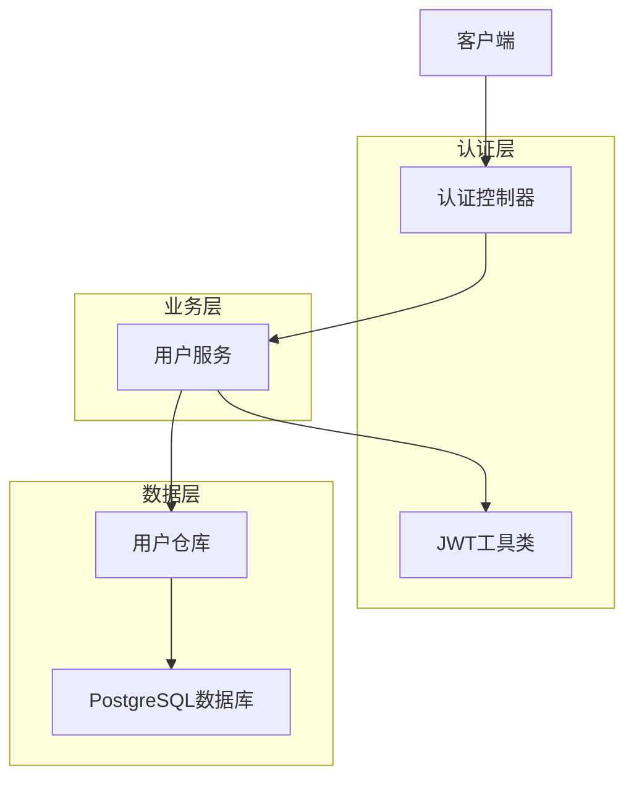

# 极简版用户认证设计文档

## 1. 设计目标

本文档旨在为万里教育加盟连锁机构后端系统设计一个极简版的用户认证系统，专注于业务功能开发，最大化开发效率。

### 1.1 核心原则
- **极简优先**：只实现最基本的用户注册和登录功能
- **业务导向**：为业务功能开发预留更多时间和精力
- **快速迭代**：使用最简单可行的技术方案
- **标准兼容**：遵循Spring Boot标准实践

## 2. 功能范围

### 2.1 包含功能
- ✅ 用户注册（用户名+密码）
- ✅ 用户登录（JWT认证）
- ✅ 基础用户信息管理

### 2.2 不包含功能
- ❌ 邮箱验证
- ❌ 密码重置
- ❌ 复杂权限管理
- ❌ 用户状态管理
- ❌ 操作日志
- ❌ 多角色权限

## 3. 技术架构

### 3.1 技术栈
- **后端框架**：Spring Boot 3.x
- **安全框架**：Spring Security（基础配置）
- **认证方式**：JWT Token
- **密码加密**：BCrypt
- **数据库**：PostgreSQL
- **ORM**：Spring Data JPA

### 3.2 架构图


## 4. 数据模型

### 4.1 用户表（users）
```sql
CREATE TABLE users (
    id UUID PRIMARY KEY DEFAULT gen_random_uuid(),
    username VARCHAR(50) UNIQUE NOT NULL,
    password_hash VARCHAR(255) NOT NULL,
    full_name VARCHAR(100),
    created_at TIMESTAMP WITH TIME ZONE DEFAULT NOW(),
    updated_at TIMESTAMP WITH TIME ZONE DEFAULT NOW()
);

-- 创建索引
CREATE INDEX idx_users_username ON users(username);
```

### 4.2 实体类设计
```java
@Entity
@Table(name = "users")
public class User {
    @Id
    @GeneratedValue(strategy = GenerationType.UUID)
    private UUID id;
    
    @Column(name = "username", unique = true, nullable = false, length = 50)
    private String username;
    
    @Column(name = "password_hash", nullable = false)
    private String passwordHash;
    
    @Column(name = "full_name", length = 100)
    private String fullName;
    
    @Column(name = "created_at")
    private LocalDateTime createdAt;
    
    @Column(name = "updated_at")
    private LocalDateTime updatedAt;
    
    // 构造函数、getter、setter省略
}
```

## 5. 核心功能实现

### 5.1 用户注册流程
1. 接收用户注册请求（用户名、密码、姓名）
2. 验证用户名唯一性
3. 使用BCrypt加密密码
4. 保存用户信息到数据库
5. 返回注册成功响应

### 5.2 用户登录流程
1. 接收登录请求（用户名、密码）
2. 根据用户名查询用户信息
3. 验证密码正确性
4. 生成JWT Token
5. 返回Token给客户端

### 5.3 JWT认证流程
1. 客户端在请求头中携带JWT Token
2. 服务端验证Token有效性
3. 从Token中提取用户信息
4. 允许访问受保护的资源

## 6. API接口设计

### 6.1 用户注册
```
POST /api/auth/register
Content-Type: application/json

{
    "username": "testuser",
    "password": "password123",
    "fullName": "测试用户"
}

响应：
{
    "success": true,
    "message": "注册成功",
    "data": {
        "id": "uuid",
        "username": "testuser",
        "fullName": "测试用户"
    }
}
```

### 6.2 用户登录
```
POST /api/auth/login
Content-Type: application/json

{
    "username": "testuser",
    "password": "password123"
}

响应：
{
    "success": true,
    "message": "登录成功",
    "data": {
        "token": "jwt_token_string",
        "user": {
            "id": "uuid",
            "username": "testuser",
            "fullName": "测试用户"
        }
    }
}
```

### 6.3 获取当前用户信息
```
GET /api/auth/me
Authorization: Bearer jwt_token_string

响应：
{
    "success": true,
    "data": {
        "id": "uuid",
        "username": "testuser",
        "fullName": "测试用户"
    }
}
```

## 7. 安全配置

### 7.1 Spring Security配置
```java
@Configuration
@EnableWebSecurity
public class SecurityConfig {
    
    @Bean
    public PasswordEncoder passwordEncoder() {
        return new BCryptPasswordEncoder();
    }
    
    @Bean
    public SecurityFilterChain filterChain(HttpSecurity http) throws Exception {
        http
            .csrf(csrf -> csrf.disable())
            .authorizeHttpRequests(auth -> auth
                .requestMatchers("/api/auth/register", "/api/auth/login").permitAll()
                .anyRequest().authenticated()
            )
            .addFilterBefore(jwtAuthenticationFilter(), UsernamePasswordAuthenticationFilter.class);
        
        return http.build();
    }
}
```

### 7.2 JWT配置
- **密钥**：使用环境变量配置
- **过期时间**：24小时
- **算法**：HS256

## 8. 错误处理

### 8.1 错误码定义
- `2001`：用户名已存在
- `2002`：用户名或密码错误
- `2003`：Token无效或过期
- `2004`：用户不存在

### 8.2 统一响应格式
```java
public class ApiResponse<T> {
    private boolean success;
    private String message;
    private T data;
    private Integer errorCode;
    
    // 构造函数、getter、setter省略
}
```

## 9. 实施计划

### 9.1 开发优先级
1. **第一阶段**（1-2天）：
   - 用户实体和数据库表
   - 用户注册功能
   - 用户登录功能
   - JWT工具类

2. **第二阶段**（0.5天）：
   - Spring Security配置
   - 统一异常处理
   - API接口测试

### 9.2 测试验收
- 使用Postman测试所有API接口
- 验证JWT Token的生成和验证
- 确保密码加密存储

## 10. 配置示例

### 10.1 application.yml
```yaml
spring:
  datasource:
    url: jdbc:postgresql://localhost:5432/wanli_db
    username: ${DB_USERNAME:wanli_user}
    password: ${DB_PASSWORD:password}
  jpa:
    hibernate:
      ddl-auto: update
    show-sql: false

jwt:
  secret: ${JWT_SECRET:your-secret-key}
  expiration: 86400000  # 24小时
```

## 11. 未来扩展预留

虽然当前采用极简设计，但在架构上为未来扩展预留了空间：

- **权限管理**：可在User实体中添加role字段
- **邮箱验证**：可添加email字段和验证状态
- **密码重置**：可添加密码重置令牌表
- **操作日志**：可添加审计日志功能

## 12. 总结

本极简版用户认证系统专注于核心功能，去除了复杂的权限管理和验证流程，为业务功能开发预留了更多时间和精力。系统采用标准的Spring Boot技术栈，确保代码的可维护性和扩展性。