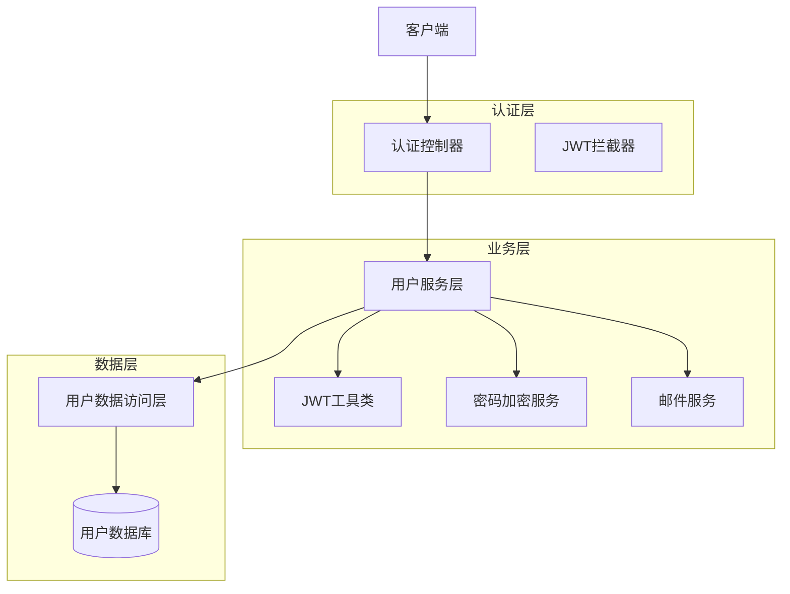
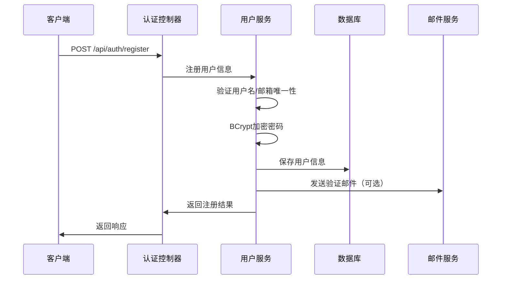
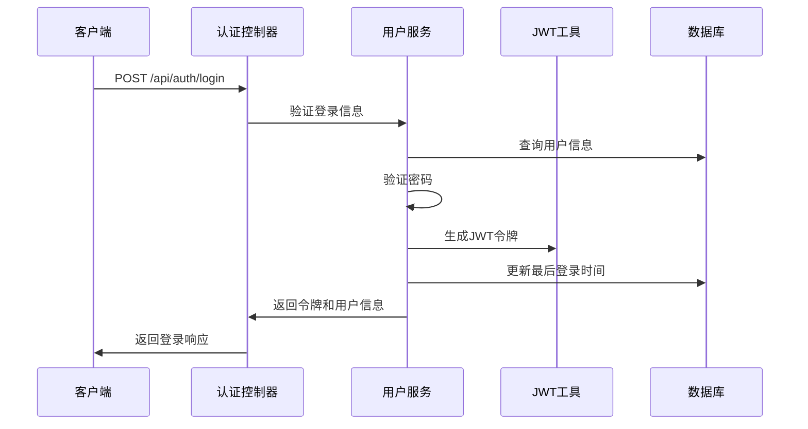
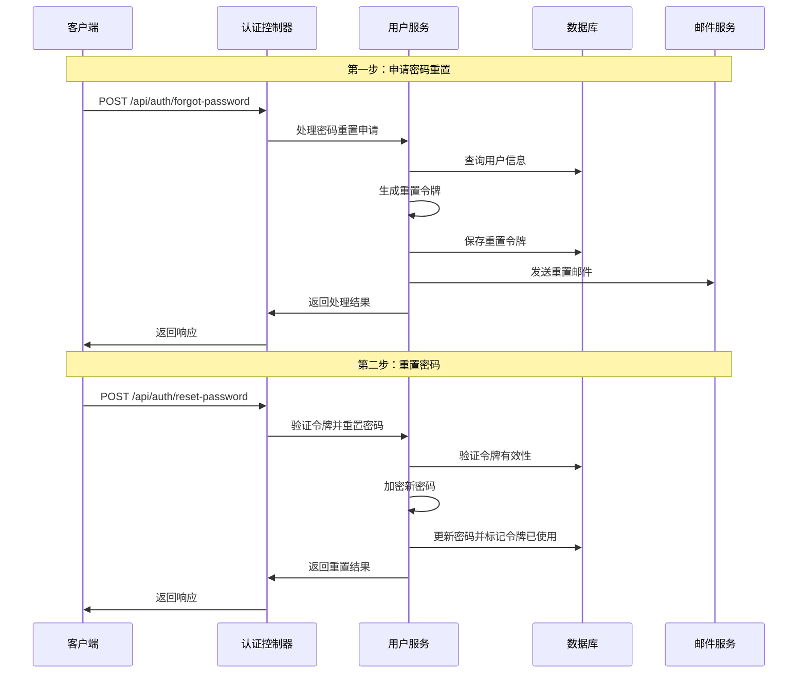

# 简化版安全认证系统设计文档

## 1. 设计概述

### 1.1 业务背景
本系统服务于初创教育加盟连锁机构，在现阶段追求简单实用的安全认证机制，避免过度复杂的权限管理系统。设计原则是满足当前基本需求的同时，为未来基于Spring Security的扩展预留架构空间。

### 1.2 核心功能
- ✅ 用户注册
- ✅ 用户登录
- ✅ 密码找回
- 🔄 邮箱验证（可选实现）
- 🚫 复杂权限管理（暂不实现）
- 🚫 操作日志（暂不实现）

### 1.3 设计原则
- **简单优先**：最小化复杂度，快速上线
- **标准兼容**：遵循Spring Boot官方规范
- **扩展预留**：为未来Spring Security集成预留接口
- **安全基础**：确保基本的安全防护

## 2. 系统架构设计

### 2.1 整体架构



### 2.2 技术栈选择
- **认证方式**：JWT (JSON Web Token)
- **密码加密**：BCrypt
- **邮件服务**：Spring Boot Mail
- **数据库**：MySQL (开发) / PostgreSQL (生产)
- **ORM框架**：Spring Data JPA

## 3. 数据模型设计

### 3.1 用户实体设计

```sql
-- 用户表
CREATE TABLE users (
    id VARCHAR(36) PRIMARY KEY COMMENT '用户ID，使用UUID',
    username VARCHAR(50) UNIQUE NOT NULL COMMENT '用户名',
    email VARCHAR(100) UNIQUE NOT NULL COMMENT '邮箱地址',
    password_hash VARCHAR(255) NOT NULL COMMENT '密码哈希值',
    full_name VARCHAR(100) COMMENT '真实姓名',
    phone VARCHAR(20) COMMENT '手机号码',
    status ENUM('ACTIVE', 'INACTIVE', 'PENDING') DEFAULT 'PENDING' COMMENT '用户状态',
    email_verified BOOLEAN DEFAULT FALSE COMMENT '邮箱是否已验证',
    created_at TIMESTAMP DEFAULT CURRENT_TIMESTAMP COMMENT '创建时间',
    updated_at TIMESTAMP DEFAULT CURRENT_TIMESTAMP ON UPDATE CURRENT_TIMESTAMP COMMENT '更新时间',
    last_login_at TIMESTAMP NULL COMMENT '最后登录时间',
    
    INDEX idx_users_email (email),
    INDEX idx_users_username (username),
    INDEX idx_users_status (status)
) COMMENT='用户基础信息表';
```

### 3.2 密码重置令牌表

```sql
-- 密码重置令牌表
CREATE TABLE password_reset_tokens (
    id VARCHAR(36) PRIMARY KEY COMMENT '令牌ID',
    user_id VARCHAR(36) NOT NULL COMMENT '用户ID',
    token VARCHAR(255) NOT NULL COMMENT '重置令牌',
    expires_at TIMESTAMP NOT NULL COMMENT '过期时间',
    used BOOLEAN DEFAULT FALSE COMMENT '是否已使用',
    created_at TIMESTAMP DEFAULT CURRENT_TIMESTAMP COMMENT '创建时间',
    
    FOREIGN KEY (user_id) REFERENCES users(id) ON DELETE CASCADE,
    INDEX idx_password_reset_token (token),
    INDEX idx_password_reset_user_id (user_id),
    INDEX idx_password_reset_expires (expires_at)
) COMMENT='密码重置令牌表';
```

### 3.3 邮箱验证令牌表（可选）

```sql
-- 邮箱验证令牌表
CREATE TABLE email_verification_tokens (
    id VARCHAR(36) PRIMARY KEY COMMENT '令牌ID',
    user_id VARCHAR(36) NOT NULL COMMENT '用户ID',
    token VARCHAR(255) NOT NULL COMMENT '验证令牌',
    expires_at TIMESTAMP NOT NULL COMMENT '过期时间',
    used BOOLEAN DEFAULT FALSE COMMENT '是否已使用',
    created_at TIMESTAMP DEFAULT CURRENT_TIMESTAMP COMMENT '创建时间',
    
    FOREIGN KEY (user_id) REFERENCES users(id) ON DELETE CASCADE,
    INDEX idx_email_verification_token (token),
    INDEX idx_email_verification_user_id (user_id)
) COMMENT='邮箱验证令牌表';
```

## 4. 核心功能设计

### 4.1 用户注册流程



**接口设计**：
```http
POST /api/auth/register
Content-Type: application/json

{
  "username": "john_doe",
  "email": "john@example.com",
  "password": "SecurePass123!",
  "fullName": "John Doe",
  "phone": "13800138000"
}
```

### 4.2 用户登录流程



**接口设计**：
```http
POST /api/auth/login
Content-Type: application/json

{
  "username": "john_doe",  // 支持用户名或邮箱登录
  "password": "SecurePass123!"
}

# 响应
{
  "success": true,
  "data": {
    "token": "eyJhbGciOiJIUzI1NiIsInR5cCI6IkpXVCJ9...",
    "tokenType": "Bearer",
    "expiresIn": 86400,
    "user": {
      "id": "uuid-string",
      "username": "john_doe",
      "email": "john@example.com",
      "fullName": "John Doe",
      "status": "ACTIVE"
    }
  }
}
```

### 4.3 密码找回流程



## 5. JWT认证机制

### 5.1 JWT配置

```yaml
# application.yml
jwt:
  secret: ${JWT_SECRET:your-256-bit-secret-key-here}
  expiration: 86400 # 24小时，单位：秒
  refresh-expiration: 604800 # 7天，单位：秒
  issuer: wanli-education
```

### 5.2 JWT载荷设计

```json
{
  "sub": "user-uuid",
  "username": "john_doe",
  "email": "john@example.com",
  "status": "ACTIVE",
  "iat": 1640995200,
  "exp": 1641081600,
  "iss": "wanli-education"
}
```

### 5.3 认证拦截器

**拦截规则**：
- 放行路径：`/api/auth/**`, `/api/public/**`, `/health`, `/actuator/**`
- 拦截路径：`/api/**`（除放行路径外）
- 验证方式：Bearer Token in Authorization Header

## 6. 安全策略

### 6.1 密码安全
- **加密算法**：BCrypt，强度12
- **密码要求**：最少8位，包含大小写字母、数字
- **密码重置**：令牌有效期24小时，单次使用

### 6.2 防护机制
- **登录限制**：同一IP 5分钟内最多尝试5次
- **令牌安全**：JWT密钥定期轮换
- **HTTPS强制**：生产环境强制HTTPS
- **CORS配置**：限制跨域访问

### 6.3 输入验证
- **用户名**：3-50字符，字母数字下划线
- **邮箱**：标准邮箱格式验证
- **密码**：8-128字符，复杂度验证

## 7. 错误处理

### 7.1 认证相关错误码

| 错误码 | 错误信息 | 说明 |
|--------|----------|------|
| 2001 | 用户名已存在 | 注册时用户名重复 |
| 2002 | 邮箱已存在 | 注册时邮箱重复 |
| 2003 | 用户名或密码错误 | 登录失败 |
| 2004 | 账号已被禁用 | 用户状态为INACTIVE |
| 2005 | 账号待激活 | 用户状态为PENDING |
| 2006 | 令牌无效或已过期 | JWT验证失败 |
| 2007 | 重置令牌无效 | 密码重置令牌错误 |
| 2008 | 登录尝试过于频繁 | 触发限流 |

### 7.2 统一异常响应格式

```json
{
  "success": false,
  "errorCode": 2003,
  "message": "用户名或密码错误",
  "timestamp": "2024-01-15T10:30:00Z",
  "path": "/api/auth/login"
}
```

## 8. 未来扩展预留

### 8.1 Spring Security集成预留

**当前设计兼容性**：
- 用户实体设计符合Spring Security UserDetails接口
- JWT认证可平滑迁移到Spring Security JWT
- 密码加密使用Spring Security推荐的BCrypt

**扩展路径**：
```java
// 未来扩展：用户实体实现UserDetails接口
@Entity
public class User implements UserDetails {
    // 现有字段保持不变
    
    // 实现UserDetails接口方法
    @Override
    public Collection<? extends GrantedAuthority> getAuthorities() {
        // 返回用户权限列表
    }
    
    @Override
    public boolean isAccountNonExpired() {
        return status == UserStatus.ACTIVE;
    }
    
    // 其他接口方法...
}
```

### 8.2 权限管理扩展预留

**数据库表预留**：
```sql
-- 角色表（未来扩展）
CREATE TABLE roles (
    id VARCHAR(36) PRIMARY KEY,
    name VARCHAR(50) UNIQUE NOT NULL,
    description VARCHAR(200),
    created_at TIMESTAMP DEFAULT CURRENT_TIMESTAMP
);

-- 用户角色关联表（未来扩展）
CREATE TABLE user_roles (
    user_id VARCHAR(36),
    role_id VARCHAR(36),
    PRIMARY KEY (user_id, role_id),
    FOREIGN KEY (user_id) REFERENCES users(id),
    FOREIGN KEY (role_id) REFERENCES roles(id)
);
```

### 8.3 功能扩展点

**预留扩展功能**：
- 多因子认证（MFA）
- OAuth2第三方登录
- 单点登录（SSO）
- 会话管理
- 操作审计日志
- 细粒度权限控制

## 9. 实施计划

### 9.1 开发优先级

**Phase 1（核心功能）**：
1. 用户实体和数据库设计
2. 用户注册功能
3. 用户登录功能
4. JWT认证拦截器

**Phase 2（密码管理）**：
5. 密码找回功能
6. 邮件服务集成
7. 密码重置流程

**Phase 3（安全加固）**：
8. 登录限流
9. 输入验证加强
10. 安全配置优化

**Phase 4（可选功能）**：
11. 邮箱验证
12. 用户状态管理
13. 基础监控

### 9.2 测试策略

**单元测试**：
- 用户服务层测试
- JWT工具类测试
- 密码加密服务测试

**集成测试**：
- 注册登录流程测试
- 密码重置流程测试
- 认证拦截器测试

**安全测试**：
- 密码暴力破解测试
- JWT令牌安全测试
- 输入注入攻击测试

## 10. 配置示例

### 10.1 开发环境配置

```yaml
# application-dev.yml
spring:
  datasource:
    url: jdbc:mysql://localhost:3306/wanli_education_dev
    username: root
    password: password
  
  mail:
    host: smtp.gmail.com
    port: 587
    username: ${MAIL_USERNAME}
    password: ${MAIL_PASSWORD}
    properties:
      mail.smtp.auth: true
      mail.smtp.starttls.enable: true

jwt:
  secret: dev-secret-key-256-bits-long
  expiration: 86400

logging:
  level:
    com.wanli.auth: DEBUG
```

### 10.2 生产环境配置

```yaml
# application-prod.yml
spring:
  datasource:
    url: ${DATABASE_URL}
    username: ${DATABASE_USERNAME}
    password: ${DATABASE_PASSWORD}
  
  mail:
    host: ${MAIL_HOST}
    port: ${MAIL_PORT}
    username: ${MAIL_USERNAME}
    password: ${MAIL_PASSWORD}

jwt:
  secret: ${JWT_SECRET}
  expiration: 86400

server:
  ssl:
    enabled: true
```

## 11. 总结

本设计文档提供了一个简化但完整的安全认证系统方案，专门针对初创教育加盟连锁机构的需求。设计特点：

**✅ 优势**：
- 实现简单，开发周期短
- 遵循Spring Boot最佳实践
- 为未来扩展预留充分空间
- 基本安全防护到位

**⚠️ 限制**：
- 权限管理功能简化
- 审计日志功能缺失
- 高级安全特性待扩展

**🚀 扩展路径**：
当业务发展需要更复杂的权限管理时，可以基于现有架构平滑升级到Spring Security + RBAC权限模型，实现企业级的安全认证系统。